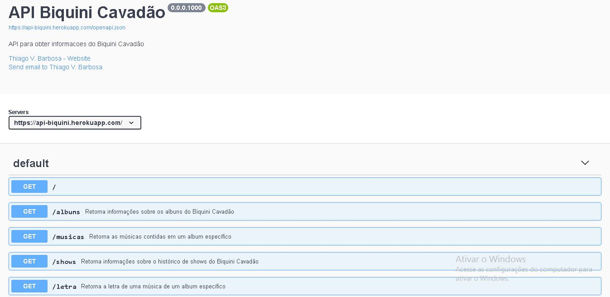

# API da banda Biquini Cavadão

---

Para você que estava ancioso(a) e sem dormir por não ter um local onde conseguir informações consistentes e estruturadas da banda **_Biquini Cavadão_**, agora pode dormir tranquilo(a). Este projeto é uma continuação do projeto `scrape-biquini` disponível em [scrape-biquini](https://github.com/Thiago-VBarbosa/scrape-biquini).

---

---

**A API foi desenvolvida com a _Linguagem R_ está disponível em [API Biquini Cavadão](https://api-biquini.herokuapp.com)**

